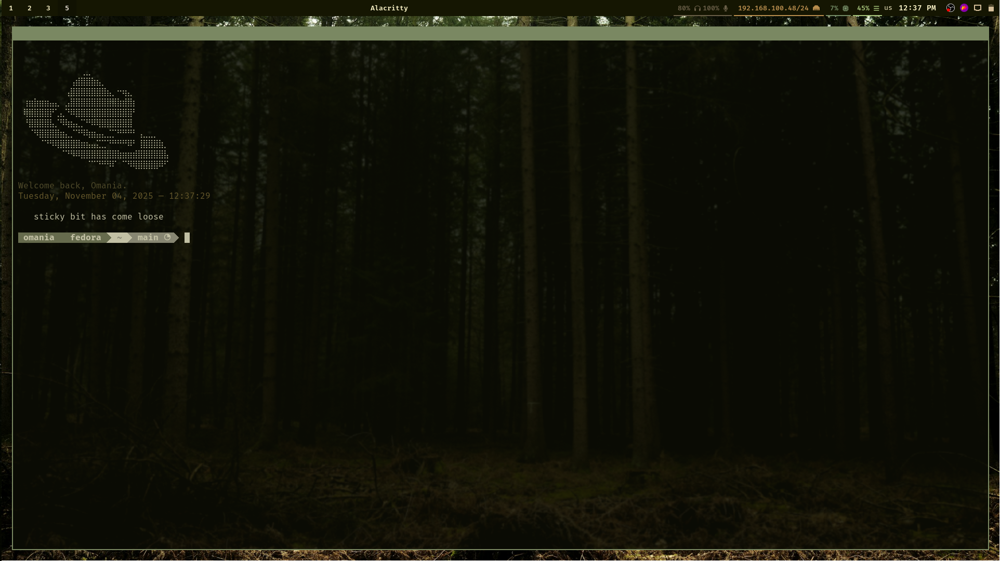
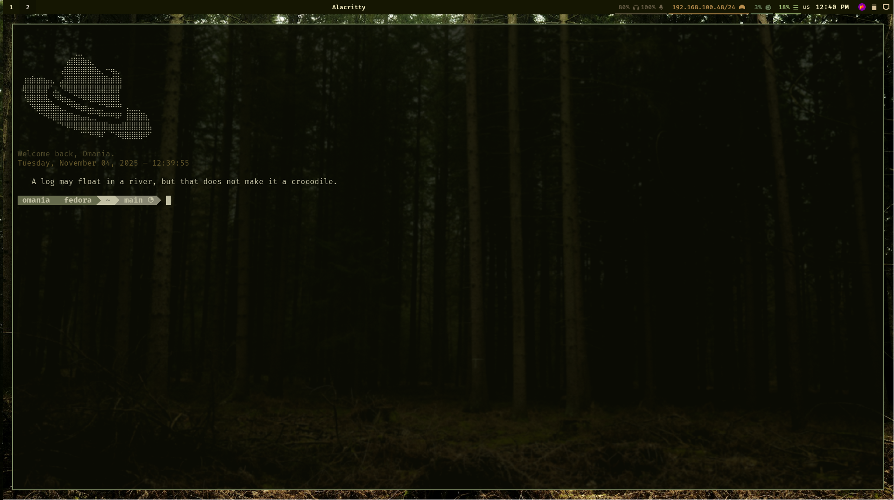

Change sway-config to "config" after copying it 
EXAMPLE: mv sway-config /home/user/.config/sway/config 

Change waybar-config to "config" after copying it 
EXAMPLE: mv waybar-config /home/user/.config/waybar/config

# Alacritty syncing with pywal

# Fastfetch

